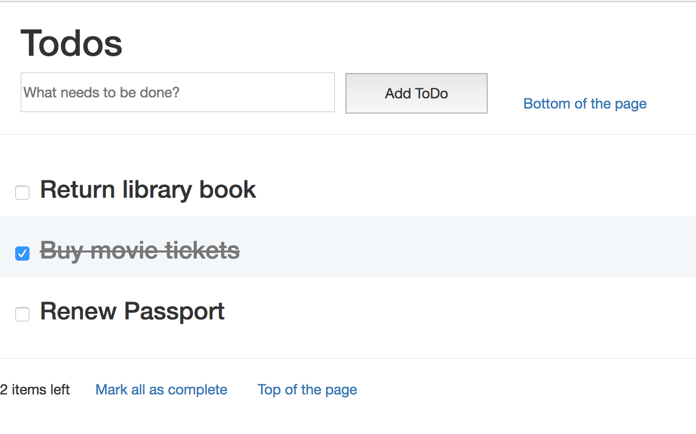

# TodoApp built using React and Flask

## Client Side Libraries
The frontend uses React <http://facebook.github.io/react/> (v13.3), jQuery, and Bootstrap.

## API and backend
The backend uses the Flask <http://flask.pocoo.org/> Python web framework and SQLite.

# Building and running on Mac OS X
`$ brew install npm`

`$ npm install --save-dev babel-cli babel-preset-react`

`$ brew install babel`

`$ babel --presets react static/js/script.jsx -o static/js/script.js`

`$ virtualenv env`

`$ source env/bin/activate`

`$ pip install -r requirements.txt`

`$ python app.py`

`$ Then visit http://127.0.0.1:5000/ in your browser.`

# To delete the SQLite database
`$ python delete_db.py`
